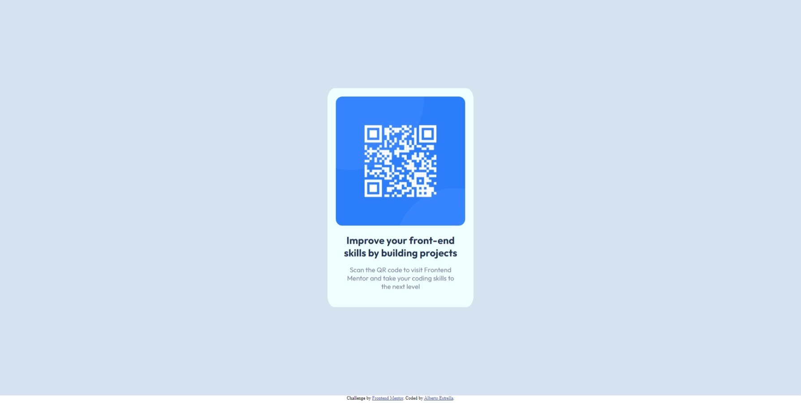

# Frontend Mentor - QR code component solution

This is a solution to the [QR code component challenge on Frontend Mentor](https://www.frontendmentor.io/challenges/qr-code-component-iux_sIO_H). Frontend Mentor challenges help you improve your coding skills by building realistic projects. 

## Table of contents

(#overview)
  - [Screenshot](#screenshot)
  - [Links](#links)
- [My process](#my-process)
  - [Built with](#built-with)
  - [What I learned](#what-i-learned)
- [Author](#author)

## Overview

### Screenshot

### Links

- Solution URL: https://github.com/Alstarjet/Frontend-Mentor---QR-code-component
- Live Site URL: https://alstarjet.github.io/Frontend-Mentor---QR-code-component/

## My process
I created a html file and see for a few minuts the desktop preview, i decided to add the css in the same file so i had few elements and it would be more easi check if something is wrong.
I used css grid to center the principal element and flex her childs.

### What I learned
I decided to resolve this challence because is so simple but i wasn't sure how to up it to repository and create a live page, so it i learned

## Author

- Frontend Mentor - https://www.frontendmentor.io/profile/Alstarjet
- Twitter - https://www.linkedin.com/in/jose-alberto-estrella-767869a7/
